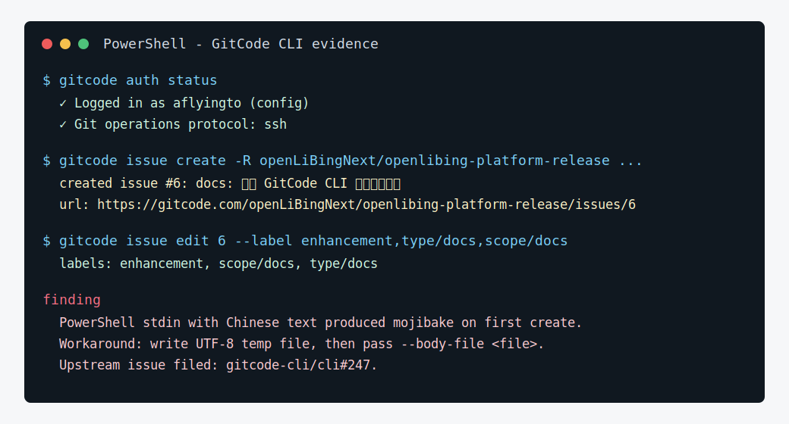

# 向发布平台提交高质量 Issue

## 场景

openLiBing 发布平台涉及发布评审、Jenkins 任务、OBS 制品下载、附件管理、漏洞扫描和发布结果追踪。用户经常会先发现一个“现象”，例如发布单卡在发布中、附件下载失败、已有 Tag 无法复用、某个制品缺少失败原因。这个案例展示如何把零散现象整理成维护者能直接分析和分派的 GitCode Issue。

## 推荐 skill

- `gitcode-issue-create` — 来自 [gitcode-cli/skills](https://gitcode.com/gitcode-cli/skills) 项目（`git@gitcode.com:gitcode-cli/skills.git`），可独立安装使用

## 适用人群

- 产品经理提交需求
- 测试人员提交缺陷
- 开源用户反馈问题
- AI 代理帮助用户整理 issue

## 可直接执行的 Prompt

```text
请使用 gitcode-issue-create skill，帮我向 openLiBingNext/openlibing-platform-release 提交一个高质量 Issue。

请全程使用 `gitcode` 命令入口；如果信息不足，先问我。

我的原始描述：
发布平台的发布决策当前已经有制品级 release_result 表，但用户在评审单详情页只能看到最终成功/失败，无法快速定位哪个软件包、哪个 Jenkins 阶段失败。希望在发布结果追踪中补充“制品级失败原因聚合视图”：

- 背景：Issue #5 已经讨论了异步发布可靠性和 release_result 预插入，本需求是在它基础上的用户可视化增强。
- 目标：按 reviewId 聚合 release_result，展示每个制品的状态、失败阶段、失败摘要、最后更新时间。
- 期望：后端提供查询接口，前端或调用方可以直接展示失败列表。
- 价值：发布负责人不用翻 Jenkins 日志和数据库就能判断失败原因。
- 验收：支持按 reviewId 查询；失败原因为空时给出默认文案；不影响现有发布流程；补充单元测试。

请先给出 issue 预览，等我确认后再创建。
```

## 预期产出

- 一个面向 `openLiBingNext/openlibing-platform-release` 的 Issue 草稿。
- 自动查重后识别是否应关联已有 Issue #5，而不是重复创建。
- 建议使用现有 `enhancement` 标签，必要时提示仓库缺少更细的 `scope/release`、`type/feature` 标签。

## 价值

- 把“发布失败看不懂”这类用户反馈变成可分派的后端增强任务。
- 让需求自然关联到已有异步发布可靠性 Issue #5，保留上下文。
- 让维护者直接看到影响范围、验收标准和测试要求，减少来回追问。

## 复用方式

### 替换清单

| 占位符 | 案例值 | 替换为 |
|---|---|---|
| 仓库 | `openLiBingNext/openlibing-platform-release` | 你的目标仓库 |
| 关联 Issue | `#5` | 已有相关 issue 编号（没有则删除引用） |
| 业务模块 | 发布结果追踪、Jenkins、OBS | 你的项目模块名 |
| 技术栈 | Java 21 / Maven / Spring Boot | 你的项目技术栈 |

### 适用场景

- 把口头反馈、碎片化描述、用户报告转为结构化 Issue
- 需要自动查重、关联已有 Issue、建议标签
- 不适合：仓库未初始化、Issue 功能未开启

### 跨平台提醒

- **Windows**：中文正文用 `Set-Content -Encoding utf8` 生成临时文件再传 `--body-file`，避免 PowerShell stdin 乱码
- **Linux/macOS**：stdin 重定向通常无编码问题，但仍建议创建后用 `gitcode issue view --json` 回读确认

### 前置条件

- `gitcode auth status` 确认已登录
- 对目标仓库有 Issue 创建权限
- （可选）安装 `gitcode-issue-create` skill

## 本次真实执行记录

本案例已在 `openLiBingNext/openlibing-platform-release` 上执行远端写操作，形成可回溯对象：

- 创建 Issue：[#6 docs: 补充 GitCode CLI 应用案例文档](https://gitcode.com/openLiBingNext/openlibing-platform-release/issues/6)
- 创建时间：2026-05-26 12:48:14 +08:00
- 标签：`enhancement`、`scope/docs`、`type/docs`
- 关联 PR：[#5 docs: sync GitCode CLI example cases](https://gitcode.com/openLiBingNext/openlibing-platform-release/merge_requests/5)



执行中发现一个 Windows 真实问题：PowerShell 直接把中文 here-string 通过 stdin 传给 `--body-file -` 时，远端正文出现乱码。已用 UTF-8 临时文件修正 Issue #6 正文，并向 `gitcode-cli/cli` 提交上游问题 [#247](https://gitcode.com/gitcode-cli/cli/issues/247)。

复用建议：在 Windows 自动化写入中文长正文时，优先使用 `Set-Content -Encoding utf8` 生成临时文件，再传给 `--body-file`；Linux/bash 场景可以继续使用 stdin，但仍建议在创建后用 `gitcode issue view --json` 回读确认。

## 相关案例

- 后续：[评审已有 Tag 发布能力 PR](./review-pr.md) — Issue 对应的 PR 创建后如何评审
- 关联：[整理发布平台 Issue 队列](./triage-issues.md) — 批量管理 Issue 时参考
