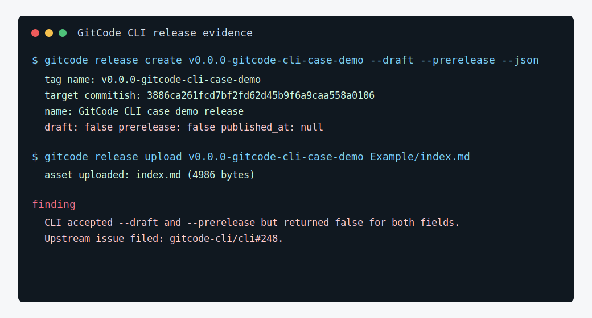

# 发布 openLiBing 发布平台版本

## 场景

`openLiBingNext/openlibing-platform-release` 当前尚未创建 release。维护者可以在合并一组发布平台增强后，基于 `master` 分支发布第一个内部版本，归档 Java 构建产物、发布说明和验证记录。

## 推荐 skill

- `gitcode-release-helper` — 发布规划和 release notes 生成
- 可辅助使用：`gitcode-release` — Release 的 CRUD 直接操作

以上 skill 来自 [gitcode-cli/skills](https://gitcode.com/gitcode-cli/skills) 项目（`git@gitcode.com:gitcode-cli/skills.git`），可独立安装使用

## 适用人群

- 维护者、发布负责人
- DevOps/交付团队
- 需要版本归档的项目经理

## 可直接执行的 Prompt

```text
请使用 gitcode-release-helper skill，帮我为 openLiBingNext/openlibing-platform-release 发布版本 v1.0.0-platform-release。

请全程使用 `gitcode` 命令入口；发布前先给我 release notes、资产清单和验证计划预览，等我确认后再创建 release。

输入：
- previous_tag: 无历史 release，请基于 master 当前提交生成首个版本说明
- version: v1.0.0-platform-release
- target_branch: master
- asset_files: target/openlibing-platform-release-1.0.jar, docs/API接口文档.md, docs/敏感信息配置说明.md
- 本版本重点变化：
  - 发布平台 Java 21 / Spring Boot 应用基础能力
  - 发布评审、Jenkins 集成、OBS 信息管理、漏洞扫描、文件下载能力
  - 本地 Docker Compose / Dev Container 开发方式
  - 当前 open issues 中的后续规划：附件管理测试覆盖、已有 Tag 发布、发布结果追踪可靠性
```

## 预期产出

- 一个面向 `openLiBingNext/openlibing-platform-release` 的 GitCode Release 预案。
- 清晰的首版 release notes，包括已具备能力、验证方式、已知后续事项。
- 确认后可创建 release 并上传 jar 与文档资产。

## 价值

- 将“代码仓已经可运行”转化为可对外交付的版本说明。
- 让发布负责人在创建 release 前先看到资产清单、验证计划和安全检查点。
- 可作为发布平台自身版本发布的示范，也能复用于其他 Java 服务。

## 复用方式

### 替换清单

| 占位符 | 案例值 | 替换为 |
|---|---|---|
| 仓库 | `openLiBingNext/openlibing-platform-release` | 目标仓库 |
| 版本号 | `v1.0.0-platform-release` | 你的语义化版本 |
| previous_tag | 无（首个版本） | 上一版本的 tag |
| 构建产物 | `target/openlibing-platform-release-1.0.jar` | 你的构建产物路径 |
| 文档资产 | `docs/API接口文档.md` 等 | 你的发布文档 |

### 适用场景

- 首次发布或常规版本发布
- 需要 release notes、资产上传、验证计划的一体化流程
- 不适合：仅打 tag 不需要 release notes 的场景

### 跨平台提醒

- 创建后必须执行 `gitcode release view <tag> --json` 回读状态，确认 draft/prerelease 字段与预期一致
- 资产路径使用正斜杠 `/`

### 前置条件

- 对目标仓库有 release 创建权限
- 构建产物已生成
- `gitcode auth status` 确认登录状态
- （可选）安装 `gitcode-release-helper` skill

## 本次真实执行记录

本案例已在 `openLiBingNext/openlibing-platform-release` 上创建演示 release，并上传案例索引资产：

- Release tag：`v0.0.0-gitcode-cli-case-demo`
- Target commit：`3886ca261fcd7bf2fd62d45b9f6a9caa558a0106`
- Release name：`GitCode CLI case demo release`
- 上传资产：`index.md`
- 关联 Issue：[#6](https://gitcode.com/openLiBingNext/openlibing-platform-release/issues/6)
- 关联 PR：[#5](https://gitcode.com/openLiBingNext/openlibing-platform-release/merge_requests/5)



执行中发现一个 release 命令/API 差异：命令传入 `--draft --prerelease` 后执行成功，但 `release create/view/list --json` 返回 `draft=false`、`prerelease=false`，同时 `published_at=null`。这会影响脚本判断“草稿/预发布是否真的生效”。已向 `gitcode-cli/cli` 提交上游问题 [#248](https://gitcode.com/gitcode-cli/cli/issues/248)。

复用建议：发布自动化不要只相信 create 命令的成功退出。创建后必须执行 `gitcode release view <tag> --json` 回读状态，并在 draft/prerelease 字段与预期不一致时停止公告或人工确认。

## 相关案例

- 前置：[评审已有 Tag 发布能力 PR](./review-pr.md) — PR 合并后才能发布
- 关联：[发布平台敏感信息与安全审查](./security-review.md) — 发布前的安全检查
- 关联：[对发布平台仓库做 CLI 冒烟验证](./regression-after-install.md) — 发布后验证 CLI 可用
