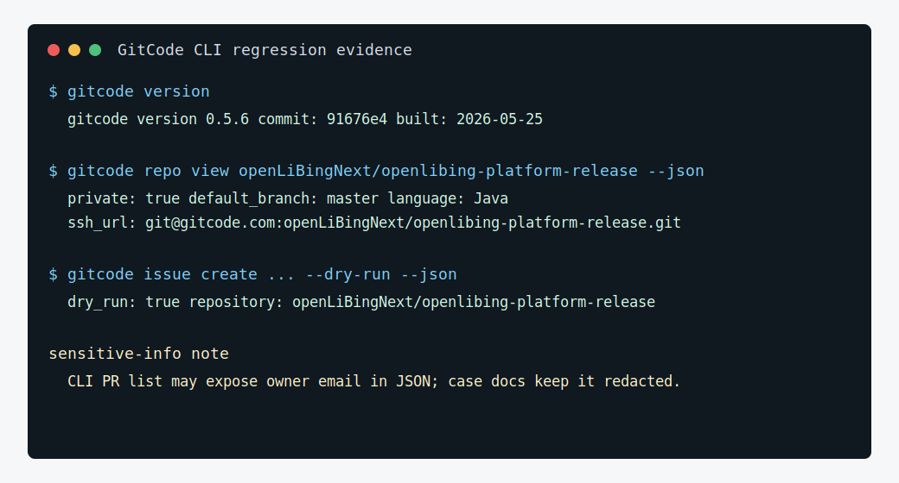

# 对发布平台仓库做 CLI 冒烟验证

## 场景

用户安装或升级 GitCode CLI 后，需要确认它能在 Windows 和 Linux 环境下稳定访问私有仓库 `openLiBingNext/openlibing-platform-release`，包括认证、SSH、仓库读取、issue/PR 列表、schema 和 dry-run 写路径。

## 推荐 skill

- `gitcode-regression` — 来自 [gitcode-cli/skills](https://gitcode.com/gitcode-cli/skills) 项目（`git@gitcode.com:gitcode-cli/skills.git`），可独立安装使用

## 适用人群

- CLI 用户（安装/升级后自检）
- 测试人员
- 发布负责人（验证新版本兼容性）

## 可直接执行的 Prompt

```text
请使用 gitcode-regression skill，对当前环境访问 openLiBingNext/openlibing-platform-release 的 GitCode CLI 能力做一次冒烟验证。

测试仓库：openLiBingNext/openlibing-platform-release

请优先使用 `gitcode` 命令入口。Windows PowerShell 不要使用裸 `gc`；Linux/macOS 需要验证 `gitcode` 和 `gc` 两个入口。写操作只允许 dry-run。

请输出验证报告，包括：
- CLI 版本和 OS/shell；
- Windows/Linux entrypoint 兼容性；
- auth 状态；
- SSH 到 `git@gitcode.com` 是否可用；
- `repo view openLiBingNext/openlibing-platform-release` 是否能读取 Java/private/default_branch 信息；
- open issue 和 open PR 列表是否能 JSON 读取；
- 对 issue create 的 dry-run 是否可用；
- 失败项、风险和建议处理方式。
```

## 预期产出

- 一份针对私有发布平台仓库的 CLI 冒烟验证报告。
- 验证 `gitcode` 能否稳定读取 repo、issue、PR，并在 dry-run 模式下验证写路径。
- Windows/Linux 命令入口差异被显式记录。

## 价值

- 比只跑 `gitcode version` 更接近真实工作流，能验证私有仓库权限。
- 能快速定位是 CLI 安装问题、认证问题、SSH 问题还是仓库权限问题。
- 适合团队要求成员安装 GitCode CLI 后提交环境自检结果。

## 复用方式

### 替换清单

| 占位符 | 案例值 | 替换为 |
|---|---|---|
| 测试仓库 | `openLiBingNext/openlibing-platform-release` | 团队自己的测试仓库 |
| CLI 版本 | `0.5.6` | 你安装的版本 |
| 写操作限制 | dry-run only | 若需真实写操作，改为安全测试仓库 |

### 适用场景

- CLI 安装/升级后的环境验证
- 团队要求成员提交环境自检结果
- CI 环境中验证 CLI 可用性
- 不适合：目标仓库无法访问（权限不足）

### 跨平台提醒

- Windows PowerShell 禁止使用裸 `gc`（被 `Get-Content` 别名占用），必须使用 `gitcode`
- Linux/macOS 下 `gitcode` 和 `gc` 等价，但建议统一用 `gitcode`

### 前置条件

- GitCode CLI 已安装（`gitcode version` 正常输出）
- `gitcode auth status` 确认已登录
- SSH 已配置（`ssh -T git@gitcode.com`）
- 对测试仓库有读权限
- （可选）安装 `gitcode-regression` skill

## 本次真实执行记录

本案例使用当前安装版本对 `openLiBingNext/openlibing-platform-release` 执行了一轮真实命令验证：

- `gitcode version`：`0.5.6`，commit `91676e4`，built `2026-05-25`
- `gitcode auth status`：登录用户 `aflyingto`，Git 操作协议 `ssh`
- `gitcode repo view --json`：目标仓为私有 Java 仓库，默认分支 `master`，SSH 地址 `git@gitcode.com:openLiBingNext/openlibing-platform-release.git`
- `gitcode issue create --dry-run --json`：返回 `dry_run=true`，确认不会产生远端 issue
- `gitcode pr list --json`：可列出 PR #1 到 #5；输出中可能包含 owner email，案例文档已脱敏不收录邮箱
- `gitcode label list --json`：确认 `enhancement`、`scope/docs`、`type/docs` 等标签存在
- `gitcode release list --json`：可回读演示 release 和上传资产



复盘：回归案例要同时覆盖”读命令、写命令、dry-run、JSON 输出、回读验证、敏感字段处理”。尤其是 JSON 输出可能含邮箱等字段，面向宣传或外部文档时必须只摘录必要字段。

## 相关案例

- 前置：[多环境认证配置](./auth-setup.md) — 验证前确保认证配置正确
- 关联：[发布 openLiBing 发布平台版本](./publish-release.md) — 新版本发布后运行回归验证
