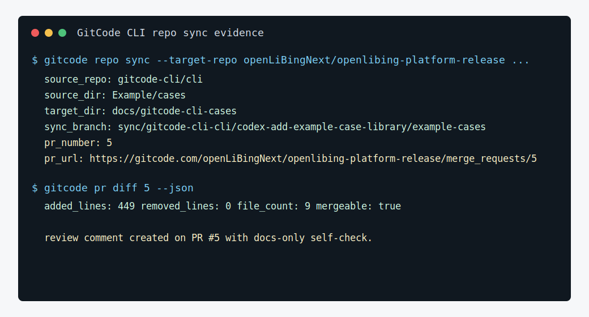

# 同步 GitCode CLI 案例到发布平台文档

## 场景

GitCode CLI 团队维护了一套应用案例，希望把其中与发布平台相关的案例同步到 `openLiBingNext/openlibing-platform-release` 的文档目录，供发布平台团队在自己的仓库内查看和复用。这个场景适合用 `gitcode repo sync` 自动创建目标仓库 PR。

## 推荐 skill

- `gitcode-repo`

## 可直接执行的 Prompt

```text
请使用 gitcode-repo skill，帮我把当前 gitcode-cli 仓库的 Example/cases 同步到 openLiBingNext/openlibing-platform-release 的 docs/gitcode-cli-cases，并创建 Pull Request。

请全程使用 `gitcode` 命令入口；repo sync 涉及代码传输，默认使用 SSH。

输入：
- source_dir: Example/cases
- target_repo: openLiBingNext/openlibing-platform-release
- target_dir: docs/gitcode-cli-cases
- base_branch: master
- 同步目的：把 GitCode CLI 在发布平台场景中的案例沉淀到发布平台仓库，方便团队成员直接复制 prompt 使用。

请先说明将执行的同步计划、PR 标题和正文，等我确认后再执行。
```

## 预期产出

- `openLiBingNext/openlibing-platform-release` 中新增或更新 `docs/gitcode-cli-cases/`。
- 自动创建一个同步 PR，说明来源、目标目录和复用价值。

## 价值

- 让 GitCode CLI 案例不只停留在 CLI 仓库，也能进入业务仓库的日常文档入口。
- 平台团队无需手动复制多份 Markdown，降低文档漂移。
- `repo sync` 自动完成 clone、copy、commit、push、create PR，展示 CLI 在多仓协作中的效率价值。

## 复用方式

复用时替换源目录、目标仓库、目标目录和目标分支即可。适合 API 合约、规范、模板、案例文档等跨仓同步。

## 本次真实执行记录

本案例已从 `gitcode-cli/cli` 当前分支把 `Example/cases` 同步到目标仓：

- 目标仓：`openLiBingNext/openlibing-platform-release`
- 目标目录：`docs/gitcode-cli-cases`
- 同步分支：`sync/gitcode-cli-cli/codex-add-example-case-library/example-cases`
- 远端 PR：[#5 docs: sync GitCode CLI example cases](https://gitcode.com/openLiBingNext/openlibing-platform-release/merge_requests/5)
- 变更规模：9 个 Markdown 文件，新增 449 行，删除 0 行
- 合并状态：`mergeable=true`



这个案例的价值不只是“复制文件”，而是形成跨仓库文档分发闭环：源仓继续维护案例库，目标业务仓通过 PR 审查后获得团队内可直接阅读的使用手册。对多仓库组织来说，这种方式可以复用到 API 契约、规范模板、CI 片段、SDK 示例同步。
