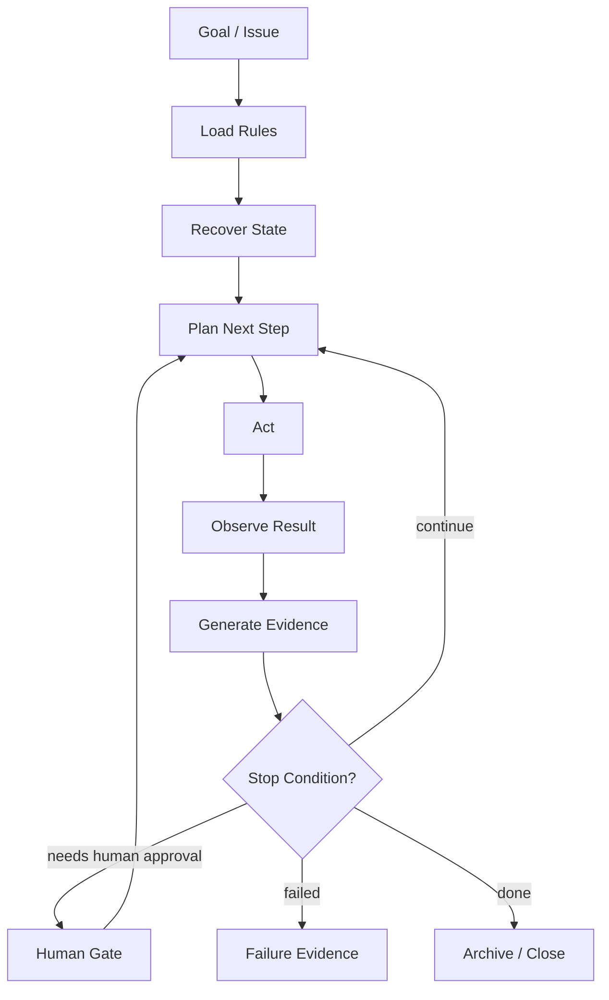
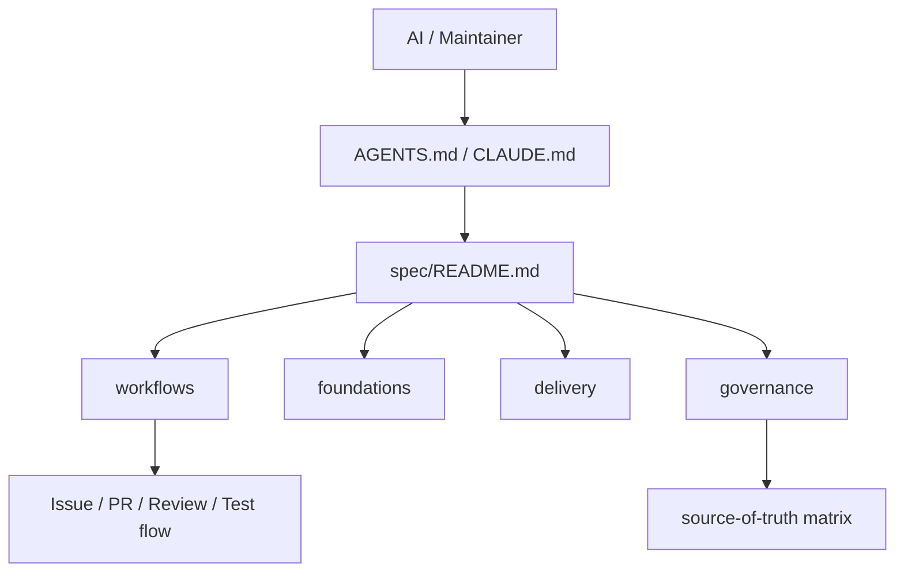
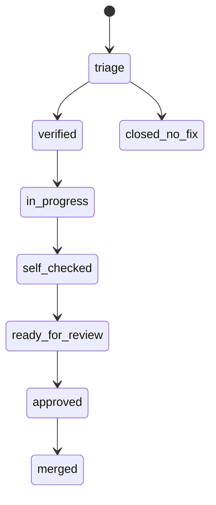
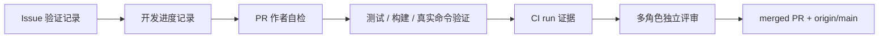
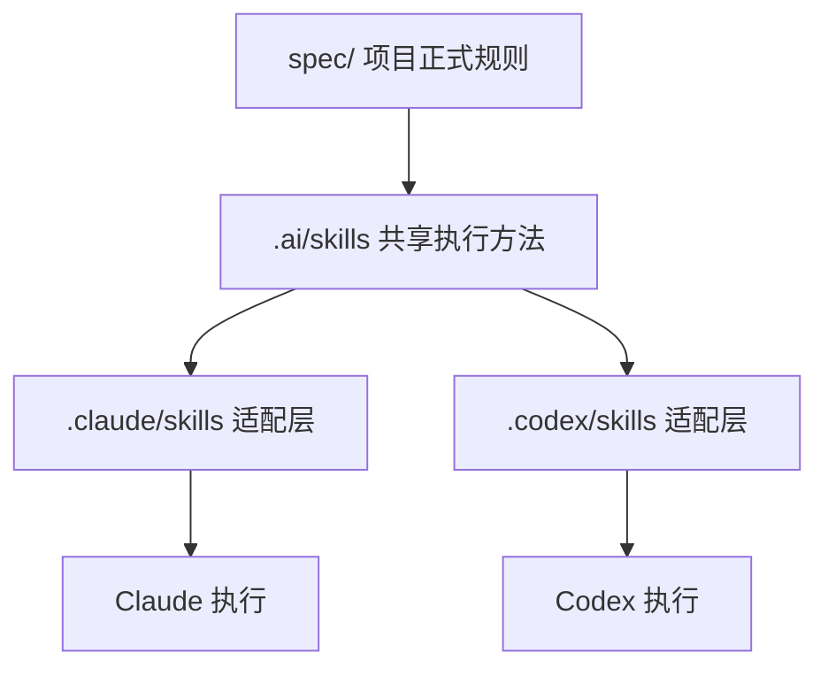
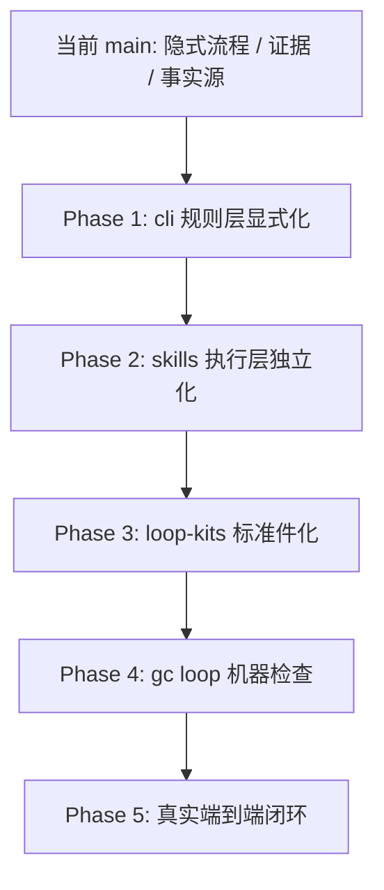
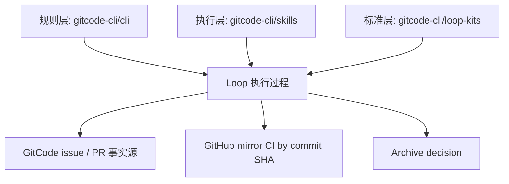

# 主干 Loop Engineering 基因分析与演进计划

本文分析当前 `main` 分支已经具备的 Loop Engineering 工程基因，并说明 `loop-engineering` 分支正在把这些隐式能力显式化、标准化、可复用化。

分析基准：

- 仓库：`gitcode-cli/cli`
- 分支：`main`
- 主干提交：`0607e2802763f6b8c5010559090d2afcbb87a573`
- 分析日期：2026-06-17

## 摘要

当前主干并不是“没有 Loop Engineering”，而是已经进入了 **Implicit Loop Engineering** 阶段：流程、证据、事实源、AI 入口、CI、自检、评审和主干完成判定都已经存在，只是这些能力仍分散在 `AGENTS.md`、`CLAUDE.md`、`spec/workflows/*`、`spec/governance/*`、`spec/delivery/ci-workflows.md`、`.ai/skills/*` 等位置。

`loop-engineering` 分支的价值不是另起炉灶，而是把主干中已经形成的工程约束抽象成显式体系：

```text
规则层：cli/spec + .loop
执行层：skills workflow
标准层：loop-kits
事实源：GitCode issue / PR
CI 边界：GitHub mirror by SHA
```

主干已经具备约 60% 的 Loop Engineering 基因，尤其强在治理、流程状态、证据要求、事实源判定和评审门禁。下一步需要补齐的是统一 loop 状态机、统一 evidence 模型、`.loop` 项目配置、独立 skills 仓、loop-kits 标准包、归档策略和后续 `gc loop` 机器检查能力。

## 标准 Loop Engineering 理论介绍

Loop Engineering 是 AI 编程从“人连续提示 agent”走向“人设计能提示 agent 的系统”的工程范式。Addy Osmani 在 2026 年 6 月的 [Loop Engineering](https://addyosmani.com/blog/loop-engineering/) 中把这个变化描述为：开发者不再只优化单次 prompt，而是设计一个能够发现任务、分派任务、检查结果、记录状态并决定下一步的循环系统。这个系统可以按计划运行，也可以围绕一个目标持续迭代，直到满足明确的停止条件。

在软件工程语境下，Loop Engineering 不是简单的“让 AI 多跑几轮”，也不是把一个长 prompt 放进定时任务。它的核心是把研发任务变成一个可恢复、可验证、可审计的控制循环。人仍然定义目标、规则、风险边界和验收标准；agent 负责在这些约束下执行、观察、修正和提交证据；系统负责保存状态、触发检查、连接工具和阻止越权动作。

### 1. 从 Prompt Engineering 到 Loop Engineering

AI 编程协作可以分成三个层次：

| 层次 | 优化对象 | 工作单位 | 典型问题 |
| --- | --- | --- | --- |
| Prompt Engineering | 单次指令怎么写 | 一轮问答 | “怎么让模型这次回答更好？” |
| Context Engineering | 模型在本轮能看到什么 | 一次任务上下文 | “怎么让模型拿到正确规则、代码、历史和工具？” |
| Loop Engineering | 谁决定下一步提示、检查和停止 | 跨多轮、跨工具、跨事实源的任务循环 | “怎么让系统持续推进任务，并证明每一步是可信的？” |

Prompt Engineering 关注语言表达，Context Engineering 关注信息供给，Loop Engineering 关注控制系统。它把研发动作从“人坐在对话框前连续驱动”升级为“系统围绕目标和证据持续驱动”。这也是它与普通 agent workflow 的关键区别：workflow 通常描述一串步骤，loop 还必须描述状态恢复、反馈、停止条件和下一轮决策。

### 2. 一个标准 loop 的最小组成

标准 Loop Engineering 至少包含六个组成部分。

| 组成 | 职责 | 工程含义 |
| --- | --- | --- |
| Goal | 定义要达成的目标和验收条件 | 没有目标，loop 会变成无界探索 |
| State | 记录当前任务阶段、已完成事项和待处理事项 | 没有状态，长任务无法恢复 |
| Policy | 定义允许动作、禁止动作、人工确认点和质量门禁 | 没有规则，agent 会把“能做”误当成“该做” |
| Tools / Connectors | 连接代码仓、Issue、PR、CI、文档、包管理和外部系统 | 没有工具，loop 只能给建议，不能进入真实工程环境 |
| Evidence | 记录每次状态跃迁、验证命令、输出摘要、失败原因和未完成边界 | 没有证据，完成声明不可审计 |
| Stop Condition | 定义什么时候继续、暂停、失败、请求人工确认或结束 | 没有停止条件，loop 会失控或过早宣布完成 |

这六个组成决定了 loop 是否能用于真实工程。缺少 Goal，系统不知道朝哪里收敛；缺少 State，系统无法跨会话延续；缺少 Policy，系统无法治理风险；缺少 Tools，系统无法进入研发事实源；缺少 Evidence，系统无法证明结果；缺少 Stop Condition，系统无法可靠停止。

### 3. 标准 loop 的控制流程

一个标准工程 loop 可以抽象为以下控制流程：



这个流程里最重要的不是 agent 的单次能力，而是每一轮都必须回到事实和规则上。`Act` 之后必须 `Observe`，`Observe` 之后必须产生 `Evidence`，`Evidence` 之后才能判断继续、失败、暂停、请求人工确认或归档。一个没有 evidence 的 loop，本质上只是自动化执行；一个没有 stop condition 的 loop，本质上只是无限重试。

### 4. 状态机是 loop 的骨架

Loop Engineering 需要状态机，因为状态机能把“任务进行中”拆成可判断的阶段。对工程任务而言，一个成熟状态机通常至少覆盖：

```text
discovered
-> triaged
-> verified
-> planned
-> executing
-> self_checked
-> review_requested
-> ci_waiting
-> ci_passed / ci_failed
-> approved
-> merged
-> archived
```

状态机的价值不在于命名本身，而在于每个状态都有进入条件、退出条件、证据要求和禁止跳转。例如，`executing` 不能直接声称 `merged`；`self_checked` 不能替代独立 review；`ci_passed` 必须绑定具体 commit SHA；`archived` 必须说明哪些经验进入长期资产，哪些只保留在 Issue / PR 里。

### 5. 事实源是 loop 的长期记忆

长期任务不能依赖聊天上下文。聊天上下文会丢失、压缩、迁移，也无法成为团队共享的审计记录。标准 Loop Engineering 必须把长期状态写入外部事实源。

在研发项目中，常见事实源划分如下：

| 事实类型 | 推荐事实源 | 不应替代它的内容 |
| --- | --- | --- |
| 需求和协作状态 | Issue | 本地临时文件、聊天记录 |
| 代码变更状态 | PR / commit SHA | Issue comment 的口头描述 |
| 主干完成事实 | merged PR + `origin/main` | 分支存在、Issue 关闭、发布文案 |
| CI 执行事实 | CI run + commit SHA | 人工转述的“应该通过” |
| 项目规则 | `spec/`、policy 文件 | agent 私有记忆 |
| 执行方法 | skills | 项目硬规则 |
| 标准数据契约 | schemas / kits | 项目运行状态 |

这也是 Loop Engineering 与普通“长任务 prompt”的分水岭：标准 loop 必须能被新 agent 从事实源恢复，而不是只能由原来的对话继续。

### 6. Skills、hooks、sub-agents 和 connectors 的角色

标准 Loop Engineering 通常会使用四类执行构件。

| 构件 | 作用 | 边界 |
| --- | --- | --- |
| Skills | 固化某类任务的执行方法和项目经验 | 不应成为项目硬规则源 |
| Hooks | 在关键生命周期点执行检查或阻断 | 不应替代人工高风险判断 |
| Sub-agents | 分离探索、实现、评审、验证角色 | 不应让同一个执行者自写自审成为唯一门禁 |
| Connectors / Adapters | 连接 Issue、PR、CI、仓库、文档和外部系统 | 不应改变事实源归属 |

这些构件让 loop 从“一个 agent 自己想办法”变成“多个受约束角色在同一事实源和规则系统下协作”。其中最关键的设计原则是分权：实现者和检查者要分离，执行方法和硬规则要分离，标准件和项目状态要分离，CI 执行事实和主仓协作事实要分离。

### 7. Open Loop 与 Closed Loop

Loop Engineering 既可以是开放循环，也可以是封闭循环。

| 类型 | 特征 | 适用场景 | 风险 |
| --- | --- | --- | --- |
| Open Loop | 目标明确但路径开放，agent 可以探索多种方案 | 审计、调研、迁移分析、跨文件排查 | 成本高，漂移风险高，难以停止 |
| Closed Loop | 路径、检查点和停止条件明确 | PR 修复、CI 排障、文档同步、规则校验 | 覆盖范围可能不足，需要持续更新规则 |

真实工程中应优先把生产性任务设计成 Closed Loop：边界清楚、证据清楚、停止条件清楚。Open Loop 更适合发现问题和生成候选方案，但一旦进入代码修改、合并、发布和归档，就必须收敛为可验证的 Closed Loop。

### 8. Loop Engineering 不等于全自动

标准 Loop Engineering 的目标不是取消工程师，而是把工程师从重复提示中移到规则设计、证据判断和风险控制上。越是强大的 loop，越需要明确人工确认点。

必须保留人工确认的典型动作包括：

- 合并到主干
- 发布版本
- 删除仓库、分支、标签或长期资产
- 修改安全、认证、权限、计费、数据迁移等高风险范围
- 改变项目正式规则或事实源边界
- 在 CI、review 或测试证据不完整时继续推进

因此，真正成熟的 loop 不是“agent 想做什么都能继续”，而是“agent 能自动推进低风险、可验证步骤，并在风险上升时准确停下”。

### 9. 标准 Loop Engineering 的成熟度阶梯

一个项目采用 Loop Engineering 通常会经历五个阶段。

| 阶段 | 名称 | 特征 |
| --- | --- | --- |
| L0 | Manual Prompting | 人手动连续提示，状态主要在聊天里 |
| L1 | Rule-Guided Agent | agent 先读项目规则，但状态和证据仍分散 |
| L2 | Explicit Loop Baseline | 有状态机、evidence、policy、facts source 和执行分层 |
| L3 | Machine-Checked Loop | 有 doctor、scan、ci、evidence 等机器检查能力 |
| L4 | End-to-End Governed Loop | 真实需求可从 Issue 跑到 archive，并保留人工高风险门禁 |

当前 `gitcode-cli` 主干大体处于 L1 到 L2 之间：规则和证据意识已经很强，但 loop 还没有显式统一。`loop-engineering` 分支的 Phase 1-3 目标是把项目推进到 L2；后续 `gc loop` 和真实端到端演示会把它推进到 L3 / L4。

## 当前主干的工程基因

### 1. AI 入口已经进入规则体系

主干的 `AGENTS.md` 和 `CLAUDE.md` 已经把 AI 从“聊天执行者”约束为“规则系统执行者”。

它们明确要求：

- 任务涉及代码、文档、流程、评审或发布时先进入 `spec/`
- `AGENTS.md` / `CLAUDE.md` 不是规则源，只是入口
- 项目正式规则以 `spec/` 为准
- 命令行为以 `docs/COMMANDS.md` 为准
- 不得在 `main` 直接开发
- 不得缺少验证记录、自检证据或独立执行主体评审就宣称完成
- 判断功能是否进入主干时，必须看 merged PR 和 `origin/main`

这已经满足 Loop Engineering 的第一个前提：AI 不再只根据对话上下文推进任务，而是先进入项目规则、事实源和门禁体系。

当前主干中的入口结构如下：



这一结构已经很接近 Loop Engineering 的 `pre-loop`：先定位规则源、任务类型、事实源和禁止行为，再开始执行。

### 2. Issue / PR 状态机已经存在

主干没有 `spec/loop/state-machine.md`，但它已经有分散在 Issue、PR、评审流程里的状态机。

`spec/workflows/issue-workflow.md` 定义了 Issue 流程：

```text
创建 Issue
-> triage
-> verified
-> in-progress
-> ready-for-review
-> merged / closed-no-fix
```

`spec/workflows/pr-workflow.md` 定义了 PR 流程：

```text
创建分支
-> 开发代码
-> 编写测试
-> 提交代码
-> 创建 PR draft
-> 作者自检
-> 风险分级
-> 第一轮多角色评审
-> approved
-> merged
```

`spec/workflows/status-label-checklist.md` 进一步把这些状态落实到远端标签：

- Issue: `status/triage` -> `status/verified` -> `status/in-progress` -> `status/merged`
- PR: `status/draft` -> `status/self-checked` -> `status/ready-for-review` -> `status/approved` -> `status/merged`

这说明主干已经不是简单 checklist 驱动，而是状态推进驱动。Loop Engineering 后续要做的是把这些状态统一映射为跨 Issue、PR、CI、评审、归档的 loop state。

当前主干状态模型可以抽象为：



它和 `loop-engineering` 分支中的标准状态机之间存在自然映射：

| 当前主干状态 | Loop Engineering 显式状态 |
| --- | --- |
| 创建 Issue | `discovered` |
| `status/triage` | `triaged` |
| `status/verified` | `verified` |
| 开发计划 / 修改范围确认 | `planned` |
| `status/in-progress` | `executing` |
| `status/self-checked` | `self_checked` |
| `status/ready-for-review` | `review_requested` |
| CI 运行中 | `ci_waiting` |
| CI 成功 / 失败 | `ci_passed` / `ci_failed` |
| `status/approved` | `approved` |
| `status/merged` | `merged` |
| 归档完成 | `archived` |

主干缺少的是统一的 loop 术语、跨状态证据 schema，以及 archive 阶段。

### 3. 证据驱动已经成型

Loop Engineering 的核心不是“流程很多”，而是每次状态推进都要有证据。主干已经具备这种工程意识。

证据要求分布在多个规范中：

- Issue 验证记录：`spec/workflows/issue-workflow.md`
- PR 作者自检：`spec/workflows/pr-workflow.md`
- 多角色评审记录：`spec/workflows/review-workflow.md`
- 测试与真实命令验证：`spec/workflows/test-workflow.md`
- CI 结果纳入自检：`spec/delivery/ci-workflows.md`
- 主干完成判定：`AGENTS.md`、`CLAUDE.md`、`source-of-truth-matrix.md`

其中最重要的是 `review-workflow.md` 对“作者自检”和“独立评审”的区分。它明确说明作者自检不是批准，不能把“我检查过”当作“评审通过”。这正是 AI 工程闭环最容易失真的地方。

当前主干的证据链可以表示为：



这条链路已经具备 Loop Engineering 的“可审计”基础。显式化之后，证据将从自由文本进一步提升为 `loop-event`、`loop-evidence`、`loop-archive` 等标准结构。

### 4. 事实源治理已经接近成熟

`spec/governance/source-of-truth-matrix.md` 是当前主干最接近 Loop Engineering 的文件之一。

它已经把不同类型的信息分成明确事实源：

| 信息类型 | 当前主干事实源 |
| --- | --- |
| 项目正式规则 | `spec/` |
| 命令行为 | `docs/COMMANDS.md` |
| 测试、门禁、评审规则 | `spec/foundations/*`、`spec/workflows/*` |
| 单个 Issue / PR 实时状态 | GitCode 远端 issue、PR、label、comment |
| 是否已主干合入 | merged PR + `origin/main` |
| CI 运行状态与结果 | GitHub Actions run |
| AI 共享场景定义 | `.ai/skills/*` |
| 阶段说明 | `issues-plan/PROGRESS.md`，但不能作为实时事实源 |

这已经具备 Loop Engineering 的事实源意识：规则、命令、协作状态、主干完成、CI、skills、阶段说明不再混为一谈。

不足也很明确：当前矩阵还没有 `loop-kits`、独立 `gitcode-cli/skills`、loop event/evidence/archive 的事实源边界。`loop-engineering` 分支正是在这一点上继续推进。

### 5. AI skill 分层已经存在

当前主干已经引入 `.ai/skills/`、`.claude/skills/`、`.codex/skills/`。

主干规则是：

- `.ai/skills/` 是共享 skill 真相源
- `.claude/skills/` 是 Claude 适配层
- `.codex/skills/` 是 Codex 适配层
- skills 不得覆盖 `spec/`
- 客户端适配层不应成为跨 AI 的唯一来源

这说明主干已经具备“执行方法”和“项目规则”分离的意识。

当前结构可以抽象为：



`loop-engineering` 分支的调整方向是把 skill 真相源进一步迁移到独立仓 `gitcode-cli/skills`，让主仓只保留兼容层和入口说明。这不是否定主干，而是把主干已有分层能力推进到跨仓可维护状态。

### 6. CI 已经作为自动化证据层存在

当前主干具备 `.github/workflows/ci.yml`，并且 `spec/delivery/ci-workflows.md` 已经定义 CI 的工程定位。

CI 不是独立的“通过即可合并”信号，而是位于本地门禁和 PR 门禁之间的自动化证据补充层：

```text
本地开发门禁
-> 推送分支 + 创建 PR
-> 远端 CI 验证
-> PR 门禁
-> 合并门禁
```

主干 CI 覆盖：

- `lint`
- 3 OS `go test -v -race -coverprofile`
- release version 脚本校验
- 3 OS build
- Docker 构建
- shell completion 生成

`ci-workflows.md` 也明确 CI 不能替代：

- 本地验证
- 真实命令验证
- 安全审查
- 文档同步
- 独立执行主体评审

这与 Loop Engineering 的 CI 边界高度一致。后续只需要把 “GitHub Actions run” 进一步绑定到 GitCode PR head SHA，并把结果写成标准 CI evidence。

## 当前主干缺失的显式 Loop Engineering 能力

主干已经有工程基因，但还没有形成显式体系。缺口集中在七个方面。

### 1. 缺少 `.loop/` 项目配置

当前主干没有 `.loop/project.yaml`、`.loop/policy.yaml`、`.loop/hooks.yaml`。

因此，AI 或未来 `gc loop` 命令不能从一个稳定位置读取：

- 当前项目的 loop 名称
- GitCode 主仓
- GitHub mirror
- skills 来源
- loop-kits 来源
- 状态缓存边界
- 人工确认点
- CI SHA 绑定规则

### 2. 缺少 `spec/loop/` 统一规范

当前状态机分散在 Issue、PR、Review、CI、Status label 文档中。它们实际有效，但缺少一个统一的 Loop Engineering 视角。

缺少的规范包括：

- loop 总规范
- 状态机
- evidence model
- hook contract
- skill contract
- mirror CI contract
- archive policy
- human approval policy

### 3. 缺少标准数据契约

主干目前主要依靠 Markdown 模板和远端评论记录证据。它足够人类审计，但机器校验能力有限。

缺少的标准契约包括：

- `loop-state.schema.json`
- `loop-event.schema.json`
- `loop-evidence.schema.json`
- `loop-policy.schema.json`
- `loop-archive.schema.json`

这些契约属于 `loop-kits`，不应把真实运行状态保存到主仓。

### 4. 缺少 Loop Hooks

当前主干有 workflow 和 checklist，但没有标准化 hook contract。

显式 Loop Engineering 需要把关键阶段抽象成可调用门禁：

- `pre-loop`
- `pre-change`
- `post-change`
- `pre-pr`
- `post-pr`
- `pre-merge`
- `post-merge`
- `archive`

这些 hook 不等同于 Git hooks，而是 Loop Engineering 阶段门禁，可由 AI skill、未来 `gc loop` 命令或外部 runner 调用。

### 5. 缺少长期任务记忆模型

主干已经要求 Issue / PR comment 保存验证和自检，但还没有显式说明哪些内容应该归档到哪里。

需要补齐的归档边界：

| 信息类型 | 归档位置 |
| --- | --- |
| 一次性执行证据 | GitCode issue / PR comment |
| 长期工程规则 | `spec/` |
| 用户说明 | `docs/` |
| AI 执行方法 | `gitcode-cli/skills` |
| 标准 schema / policy / hook / template | `gitcode-cli/loop-kits` |
| CI 原始事实 | GitHub Actions run URL |
| 产品化能力 | CLI 代码 |

### 6. 缺少独立 skills 仓作为长期 skill 源

当前主干把 `.ai/skills/` 作为共享 skill 真相源。这个方案对仓内治理有效，但对长期多项目复用不够理想。

独立 `gitcode-cli/skills` 可以解决：

- skills 单独版本化
- 多项目复用
- 主仓不再承载全部 AI 执行方法
- Codex / Claude / 其他客户端可以共享同一执行源

### 7. 缺少 `gc loop` 机器检查能力

当前主干需要 AI 或人工按文档执行流程。它已经能运行，但机器可验证程度仍有限。

后续 `gc loop` 应优先实现检查和证据能力，而不是一开始实现全自动执行：

- `gc loop doctor`
- `gc loop scan`
- `gc loop ci`
- `gc loop evidence`

这类命令只负责读取事实、检查缺口、生成证据，不应越过人工确认点。

## `loop-engineering` 分支正在做什么

`loop-engineering` 分支已经把主干的隐式能力推进为显式 Demo v1。该分支相对旧主干包含以下关键提交：

| 提交 | 作用 |
| --- | --- |
| `d0d0016` | 忽略 `.loop-output/` 本地研发输出 |
| `de0e0e8` | 将 skill 真相源迁移到独立 `gitcode-cli/skills` |
| `c72025c` | 更新事实源矩阵和 AI 协作规则 |
| `cd97f5c` | 新增 `spec/loop/` 规范集 |
| `aaa9497` | 新增 `.loop/` 配置和公开 Loop Engineering 文档 |
| `721f84d` | 更新 workflow 与 mirror CI 协同说明 |
| `29fc0fc` | 新增分支验证演示文档 |

分支目标可以概括为三层落地：



### Phase 1：主仓规则层

目标是在 `gitcode-cli/cli` 中建立项目级 Loop Engineering 规则，而不实现 `gc loop` 命令。

内容包括：

- `.loop/project.yaml`
- `.loop/policy.yaml`
- `.loop/hooks.yaml`
- `spec/loop/*`
- `docs/LOOP_ENGINEERING*.md`
- `docs/MIRROR_CI.md`
- `docs/HOOKS.md`
- 更新 `AGENTS.md`、`CLAUDE.md`、`spec/governance/*`、`spec/workflows/*`

Phase 1 的意义是让主干已有流程被统一命名、统一入口、统一事实源。

### Phase 2：skills 执行层

目标是在独立 `gitcode-cli/skills` 仓中定义 AI 如何执行 loop。

已规划的 skills：

- `gitcode-loop-engineering`
- `gitcode-loop-ci`
- `gitcode-loop-archive`

这些 skill 不定义项目硬规则，而是读取目标项目的 `spec/` 和 `.loop/policy.yaml`，再使用 loop-kits 模板和契约执行任务。

### Phase 3：loop-kits 标准层

目标是在 `gitcode-cli/loop-kits` 仓中提供可复用标准件。

标准包包括：

- schemas
- policies
- templates
- hooks
- adapters

`loop-kits` 不保存项目运行状态。它只定义机器可消费的契约、模板和调用边界。

### Phase 4：`gc loop` 命令

Phase 4 不应实现全自动 `gc loop run`。

优先级应该是：

```text
gc loop doctor
  检查项目是否具备 loop 能力

gc loop scan
  扫描 issue / PR / CI / evidence 缺口

gc loop ci
  从 GitCode PR head SHA 查询 GitHub mirror CI

gc loop evidence
  生成或校验证据包
```

这些命令的定位是机器可验证辅助层，不是替代 AI skill、评审或人工确认。

### Phase 5：真实端到端演示

完整演示应覆盖：

```text
Issue
-> triage
-> verified
-> plan
-> branch
-> change
-> self-check
-> PR
-> mirror CI by commit SHA
-> review
-> merge
-> origin/main verification
-> archive decision
```

只有完成 merged PR 和 `origin/main` 验证后，才能宣称进入 `merged`。只有完成归档判定并写回证据后，才能宣称进入 `archived`。

## `loop-engineering` 分支的 Loop Engineering 能力分析

`loop-engineering` 分支已经具备一套可演示的 Loop Engineering Demo v1 能力。它不是完整产品化实现，也不是 `gc loop run` 自动执行器；它的能力边界更准确地说是：**用项目规则、AI skills、loop-kits 标准件、GitCode 事实源和 GitHub mirror CI 契约，支撑一个人工确认保留、人机协同编排、证据可回写的工程闭环**。

这套能力已经可以跑真实需求，但当前运行方式是 v1 手动编排：AI 读取规则和策略，按状态机推进任务，引用标准模板和契约，执行本地变更与验证，再把证据写回 GitCode Issue / PR。还没有进入 Phase 4 的 `gc loop doctor`、`gc loop scan`、`gc loop ci`、`gc loop evidence` 命令化阶段。

### 1. 能力分层已经完整成型

`loop-engineering` 分支的核心价值在于完成了三层能力拆分。



规则层负责回答“这个项目允许怎样推进”，执行层负责回答“AI 应该怎样执行”，标准层负责回答“哪些数据、模板、hook、adapter 可以复用”。这三个问题在主干中已经有雏形，但仍散落在 workflow、governance、skills 和 CI 文档中；`loop-engineering` 分支第一次把它们拆成了清晰的三层结构。

| 层级 | 分支能力 | 主要证据 |
| --- | --- | --- |
| 规则层 | 定义项目级 Loop Engineering 规则、状态机、证据、CI 边界、人工确认点 | `spec/loop/*`、`.loop/*`、`docs/LOOP_ENGINEERING*.md` |
| 执行层 | 定义 AI 如何跑完整 loop、如何收集 mirror CI、如何归档长期记忆 | `gitcode-loop-engineering`、`gitcode-loop-ci`、`gitcode-loop-archive` |
| 标准层 | 定义 schema、policy、template、hook、adapter 契约 | `loop-kits/schemas`、`policies`、`templates`、`hooks`、`adapters` |
| 事实源 | GitCode issue / PR 保存长期状态和证据 | Issue #299、PR !242、Issue/PR comments |
| CI 边界 | GitHub mirror Actions 只作为 CI 执行事实源 | `mirror-ci-contract.md`、`ci-github-mirror.policy.yaml`、GitHub Actions adapter |

### 2. 规则层能力：从 workflow 文档升级为 loop 规范

`gitcode-cli/cli` 的 `loop-engineering` 分支已经建立了显式规则层。它新增的 `spec/loop/` 不替代现有 Issue / PR / Review 流程，而是把它们抽象成统一 Loop Engineering 规则。

规则层能力包括：

- `loop-engineering.md`：定义整体架构和分层关系
- `state-machine.md`：定义标准状态机
- `evidence-model.md`：定义证据类型和存储边界
- `hook-contract.md`：定义阶段门禁 hook
- `skill-contract.md`：定义 AI skill 与项目规则的关系
- `mirror-ci-contract.md`：定义 GitCode PR 与 GitHub mirror CI 的 SHA 绑定关系
- `archive-policy.md`：定义一次性证据、长期规则、用户文档、AI 方法、标准件的归档边界
- `human-approval-policy.md`：定义必须保留人工确认的节点

这套规则层已经让 loop 的基本生命周期可被统一描述：

```text
discovered
-> triaged
-> verified
-> planned
-> executing
-> self_checked
-> review_requested
-> ci_waiting
-> ci_passed / ci_failed
-> approved
-> merged
-> archived
```

与主干相比，这里最重要的提升是“跨流程统一”。主干已有 Issue 状态、PR 状态、CI 证据和评审规则，但缺少一个共同的 loop 语义层。`loop-engineering` 分支通过 `spec/loop/` 把这些流程归并到同一套状态和证据语言里，使 AI、维护者、未来 CLI 命令都能围绕同一模型工作。

### 3. `.loop/` 项目配置让规则可以被机器读取

`loop-engineering` 分支新增 `.loop/`，这是从“人读文档”迈向“机器可检查”的关键一步。

`.loop/project.yaml` 定义：

- 项目名称
- GitCode 主仓
- GitHub mirror
- 参考 Issue
- truth sources
- skills 来源
- loop-kits 来源
- runtime cache 边界

`.loop/policy.yaml` 定义：

- 必须使用非 main 分支
- 必须有关联 Issue / PR 上下文
- 状态推进必须有证据
- CI 必须绑定 commit SHA
- approval 前必须有独立评审
- 完成判定必须看 `origin/main`
- merge、release、仓库创建/删除、规则冲突、高风险范围变化等必须人工确认

`.loop/hooks.yaml` 则把阶段门禁拆为可调用 hook。即使当前还没有 `gc loop` 命令，这些 YAML 已经让 AI 或外部 runner 可以按配置执行“项目级 doctor”式检查。

这说明 `loop-engineering` 分支已经具备 **policy-as-data** 的雏形：规则不只写在自然语言规范里，也被提取为可消费配置。

### 4. 执行层能力：skills 能跑 v1 手动闭环

`gitcode-cli/skills` 的 `loop-engineering` 分支新增三个 workflow skills。

| Skill | 作用 | 能力边界 |
| --- | --- | --- |
| `gitcode-loop-engineering` | 执行或协调完整工程 loop | 读取目标项目 `spec/`、`.loop/project.yaml`、`.loop/policy.yaml`，不定义项目硬规则 |
| `gitcode-loop-ci` | 收集 GitCode PR 到 GitHub mirror CI 的证据 | 绑定 PR head SHA，不把 mirror 当主仓事实源 |
| `gitcode-loop-archive` | 判断证据、规则、文档、AI 方法、标准件应归档到哪里 | 不把一次性执行记录升级成长期规则 |

这三个 skill 的组合使 v1 手动闭环可以实际运行：

```text
读 Issue / PR
-> 读 spec/loop 和 .loop policy
-> 判断当前状态和缺口
-> 执行变更
-> 自检
-> 创建或更新 PR
-> 生成 evidence comment
-> 判断是否需要 CI / review / archive
```

它的关键设计是“不抢规则源”。Skill 只是执行方法，项目硬规则仍在目标仓 `spec/` 和 `.loop/policy.yaml`。这避免了 AI skill 自己变成隐形规则源，也让同一 skill 可以用于其他项目。

### 5. 标准层能力：loop-kits 已具备标准资源包形态

`gitcode-cli/loop-kits` 的 `loop-engineering` 分支已经具备标准资源包的基本结构。

它包含五类标准件：

| 类型 | 内容 | 能力 |
| --- | --- | --- |
| schemas | `loop-state`、`loop-event`、`loop-evidence`、`loop-policy`、`loop-archive` | 定义机器可校验数据契约 |
| policies | default、gitcode-cli、mirror CI、human approval、merge gates | 提供可复用策略基线 |
| templates | triage、verification、plan、self-check、PR body、CI evidence、review、archive | 提供证据和评论模板 |
| hooks | pre-loop、pre-change、post-change、pre-pr、post-pr、pre-merge、post-merge、archive | 定义阶段门禁契约 |
| adapters | GitCode、GitHub Actions、local Git | 定义事实读取和证据写回边界 |

更重要的是，loop-kits 明确“不保存项目运行状态”。这保证了标准包不会变成另一个事实源。项目运行状态仍然属于 GitCode Issue / PR，本地文件只作为缓存或临时输出。

因此，loop-kits 的能力不是“运行一个 loop”，而是给所有 loop 执行者提供共同语言：事件怎么写，证据怎么写，CI 证据怎么表达，归档判定怎么描述，hook 在哪个阶段触发。

### 6. 事实源与状态恢复能力已经可演示

`loop-engineering` 分支已经验证了“长期任务记忆不依赖聊天上下文”的核心能力。

当前事实源划分是：

- GitCode Issue / PR：协作状态、长期状态、证据评论
- GitCode `origin/main`：主干完成事实
- GitHub mirror Actions：CI 执行事实
- commit SHA：GitCode PR 与 GitHub Actions run 的绑定键
- `gitcode-cli/skills`：AI 执行方法
- `gitcode-cli/loop-kits`：标准件
- `.loop-output/`：本地未跟踪临时输出

这套事实源已经在 Issue #299 中实际运行过：

- Phase 1-3 交付结果写回 Issue #299
- 分支验证结果写回 Issue #299
- 真实 v1 loop run 的自检证据写回 Issue #299 和 PR !242
- 本地 `.loop-output/loop-engineering-branch-verification.json` 只作为未提交临时证据

这说明 `loop-engineering` 分支不仅定义了“状态应该写回 GitCode”，而且已经实际做到了。

### 7. 已经跑通过一个真实 v1 loop run

`loop-engineering` 分支不只是静态设计。它已经跑过一个真实需求：

> 补充 `docs/LOOP_ENGINEERING_DEMO.md`，记录不合 `main`、直接验证 `loop-engineering` 分支的实践过程。

该需求的状态推进为：

```text
discovered
-> triaged
-> verified
-> planned
-> executing
-> self_checked
-> review_requested
```

对应证据：

- commit：`29fc0fc docs(loop): add branch verification demo record`
- PR：`gitcode-cli/cli!242`
- Issue 证据评论：`comment_175882711`
- PR 证据评论：`comment_9c7a42e23ff62bfa52569afd71d22bbf53ead5d1`

这个 run 证明了 v1 能实际执行：

- 从需求进入 Issue / PR 事实源
- 在非 main 分支修改文档
- 自检 diff 和检索结果
- 提交并 push
- 回读 PR head SHA
- 把状态推进和验证命令写回远端评论
- 明确不宣称 `ci_passed`、`merged`、`archived`

这就是 Loop Engineering 的基本价值：不是让 AI 一口气宣称完成，而是让每个阶段的完成含义都被证据约束。

### 8. 当前已经能演示的能力

`loop-engineering` 分支当前已经能支撑以下演示：

| 演示能力 | 当前是否具备 | 说明 |
| --- | --- | --- |
| 规则入口演示 | 是 | `spec/loop/README.md`、`.loop/README.md`、`docs/LOOP_ENGINEERING.md` |
| 状态机演示 | 是 | `spec/loop/state-machine.md` 覆盖 13 个状态 |
| 事实源演示 | 是 | `source-of-truth-matrix.md` 和 Issue #299 远端评论 |
| 证据模型演示 | 是 | `evidence-model.md`、loop-kits evidence schema、真实 evidence comment |
| AI 执行 skill 演示 | 是 | `gitcode-loop-engineering` 等三个 skills |
| 标准件演示 | 是 | loop-kits schemas / policies / templates / hooks / adapters |
| 本地临时输出边界 | 是 | `.loop-output/` ignored，且明确不提交 |
| PR 更新和证据回写 | 是 | PR !242 已被真实 v1 run 更新 |
| CI mirror by SHA 契约 | 部分具备 | 契约和 skill 已有，真实 GitHub Actions run 尚未在本次验证中抓取 |
| `gc loop` 命令演示 | 不具备 | Phase 4 才实现 |
| merge / archive 完整闭环 | 不具备 | 需要人工 review、合并、`origin/main` 验证和 archive decision |

因此，当前最准确的能力定位是：

```text
可以演示 Loop Engineering v1 的人机协同闭环；
可以跑真实 docs-only 需求到 review_requested；
可以证明规则、skills、loop-kits、GitCode 事实源已经协同；
尚不能证明全自动命令化、真实 CI 采集、主干合入和最终归档。
```

### 9. 成熟度评估

| 能力维度 | 成熟度 | 判断 |
| --- | --- | --- |
| 规则完整性 | 高 | `spec/loop/` 已覆盖状态、证据、hook、skill、CI、归档、人工确认 |
| 项目配置 | 中高 | `.loop/` 已有 project / policy / hooks，但尚无 CLI doctor 校验 |
| AI 执行方法 | 中高 | 三个 loop skills 已有，但仍需在更多真实需求中验证 |
| 标准件 | 中 | loop-kits 结构完整，v1 以契约和模板为主，自动化仍轻量 |
| 事实源回写 | 高 | Issue / PR comment 已实际写回多次 |
| CI 协同 | 中 | mirror CI 契约已定义，真实 run 查询尚未作为本次验证的一部分完成 |
| 机器可验证性 | 中 | schema 和 policy 存在，但 `gc loop` 命令尚未实现 |
| 端到端完成度 | 中 | 已到 `review_requested`，未到 `merged` / `archived` |

整体判断：`loop-engineering` 分支已经达到 **Demo v1 可演示、可评审、可继续产品化** 的状态。它不是原型草图，而是一套已经在真实 PR 和 Issue 上运行过的工程闭环框架；但它还不是最终产品，因为命令化、真实 mirror CI 拉取、主干合入验证和归档闭环仍待 Phase 4/5 完成。

### 10. 与完整 Loop Engineering 的差距

当前差距主要不是“有没有规则”，而是“规则如何变成稳定工具能力”。

后续还需要：

- 将 `.loop/project.yaml`、`.loop/policy.yaml`、loop-kits schema 接入 `gc loop doctor`
- 将 Issue / PR / CI 缺口扫描接入 `gc loop scan`
- 将 GitCode PR head SHA 与 GitHub Actions run 查询接入 `gc loop ci`
- 将 loop event / evidence / archive decision 的生成与校验接入 `gc loop evidence`
- 在真实非 docs-only 需求中跑到 CI、review、merge、origin/main 验证和 archive
- 将当前分支 rebase 到最新 `origin/main`，处理主干漂移

这意味着 `loop-engineering` 分支已经完成“能力框架”，下一步是把框架产品化、自动化和合入主干。

## 达到真正 Loop Engineering 的下一步演进与主干合入条件

`loop-engineering` 分支当前已经证明 Phase 1-3 的框架成立：规则层、执行层、标准层和远端事实源可以协同起来，真实需求也已经跑到 `review_requested`。但如果要把它称为“真正的 Loop Engineering”，还不能停留在“文档描述完整”和“人工按流程执行成功”。真正的目标应当是：任何一次工程任务都能被状态机约束，被事实源恢复，被证据模型检查，被 CI 结果绑定，被人工确认点拦截，并在结束后把一次性证据、长期规则和可复用资产归档到正确位置。

换句话说，下一阶段不是继续扩写文档，而是把已经成型的工程约束转化为稳定的运行能力。`loop-engineering` 分支可以先合入主干成为显式规则基线，但只有在命令化检查、证据回写、CI 桥接和归档闭环落地之后，才适合对外宣称为完整 Loop Engineering reference implementation。

### 1. 真正 Loop Engineering 的判定标准

真正的 Loop Engineering 至少需要满足六个条件。

| 判定维度 | 应达到的状态 | 当前 `loop-engineering` 分支状态 |
| --- | --- | --- |
| 状态可恢复 | 新 agent 或新会话可以从 GitCode Issue / PR 恢复任务状态，而不是依赖聊天上下文 | 已有事实源设计和真实评论写回，但尚无自动扫描命令 |
| 规则可检查 | 项目规则不仅写在文档中，也能被机器读取和校验 | `.loop/policy.yaml` 和 loop-kits schema 已有，尚未接入 `gc loop doctor` |
| 证据可验证 | 每个状态跃迁都有 evidence，且 evidence 结构可校验 | evidence model 和模板已有，尚未形成统一校验命令 |
| CI 可绑定 | GitCode PR head SHA 能精确绑定 GitHub mirror Actions run | 契约和 skill 已有，真实 CI run 拉取还未产品化 |
| 人工确认可拦截 | merge、release、高风险范围变化、规则冲突等动作必须显式确认 | policy 已定义，尚未由命令或 hook 稳定执行 |
| 归档可分层 | 一次性证据、长期规则、用户文档、AI 方法、标准件能分流归档 | archive policy 和 archive skill 已有，真实 `archived` 状态未跑通 |

这六个维度说明，Phase 1-3 解决的是“框架是否存在”和“能否人工演示”，Phase 4/5 要解决的是“框架是否可执行、可检查、可恢复、可长期维护”。

### 2. 下一步演进方向

`loop-engineering` 分支下一步应沿四条主线演进。

第一条主线是 **规则产品化**。`spec/loop/` 和 `.loop/` 已经把规则显式化，但还没有形成稳定的项目健康检查能力。下一步应实现 `gc loop doctor`，检查 `.loop/project.yaml`、`.loop/policy.yaml`、`.loop/hooks.yaml` 是否存在、能否解析、是否引用可访问的 skills 仓和 loop-kits 仓、是否定义了 GitCode 主仓与 GitHub mirror 的边界、是否错误地把运行状态写入标准件仓或主仓。

第二条主线是 **证据产品化**。当前 evidence 主要靠人工或 agent 写回评论。下一步应实现 `gc loop evidence`，至少支持生成和校验四类 evidence：triage evidence、implementation evidence、self-check evidence、CI evidence。它不需要替代 agent 写作，但需要让 agent 产出的证据能够被机器检查，例如必须包含 Issue / PR、commit SHA、状态迁移、验证命令、验证结果和未完成边界。

第三条主线是 **CI 桥接产品化**。当前 GitHub mirror CI 的原则已经清楚：GitHub Actions 是 CI 执行事实源，不是项目协作事实源。下一步应实现 `gc loop ci` 或等价脚本，按 GitCode PR head SHA 查询 GitHub mirror Actions run，生成可回写 GitCode PR 的 CI evidence。这里的关键不是“CI 是否通过”四个字，而是 evidence 必须说明：哪个 GitCode PR、哪个 head SHA、哪个 GitHub workflow run、运行时间、结论、失败日志入口和是否允许进入下一状态。

第四条主线是 **长期记忆与归档产品化**。Loop Engineering 的长期记忆不应存在于 agent 聊天记录里，也不应把所有中间产物提交到仓库。下一步应把 archive policy 真正跑起来：一次性执行记录留在 Issue / PR comment，结构化临时输出留在 `.loop-output/` 或 `.loop/runtime`，长期规则进入 `spec/` 或 `.loop/policy.yaml`，AI 执行方法进入 `gitcode-cli/skills`，标准契约进入 `gitcode-cli/loop-kits`，用户可读说明进入 `docs/`。只有这条分流规则被真实执行，Loop Engineering 才不会随着多轮任务变成不可维护的材料堆叠。

### 3. 需要继续落地的能力清单

下一阶段建议按“先可检查，再可回写，再可自动化”的顺序推进。

| 优先级 | 能力 | 目标产物 | 完成标准 |
| --- | --- | --- | --- |
| P0 | 分支重放与主干漂移处理 | `loop-engineering` rebase 或 merge 到最新 `origin/main` | 无冲突残留，治理文档和 skill 真相源表述一致 |
| P0 | 依赖仓稳定 | `loop-kits` 和 `skills` 的 `loop-engineering` PR 可合入或已合入 | `cli` 主干不引用只存在于临时分支的标准件 |
| P0 | Schema / policy 基础验证 | JSON schema parse、YAML policy parse、README 链接检查 | 验证命令写入 PR evidence |
| P1 | `gc loop doctor` | 最小命令或脚本入口 | 能检查 `.loop` 配置、事实源边界、依赖仓引用和本地输出忽略规则 |
| P1 | `gc loop evidence` | evidence 生成或校验入口 | 能校验 Issue / PR、commit、状态迁移、验证命令、未完成边界 |
| P1 | `gc loop ci` | GitCode PR SHA 到 GitHub Actions run 的桥接入口 | 能生成绑定 SHA 的 CI evidence，并可回写 GitCode PR |
| P1 | 真实非 docs-only 需求演示 | 一个小型代码或配置变更 PR | 跑到 `ci_passed` 或明确 `ci_failed`，并有 review evidence |
| P2 | archive 决策落地 | `archive` evidence 和归档记录 | 能说明哪些内容进入 `spec/`、`docs/`、`skills`、`loop-kits`，哪些只留在 Issue / PR |
| P2 | hooks 可执行化 | pre-loop / pre-pr / pre-merge 最小 hook | 能作为本地或 CI 中的轻量检查被调用 |
| P2 | 版本化发布 | `loop-kits` tag、skills registry 版本、cli 文档引用版本 | 外部项目可以按版本引用，不依赖某个漂移分支 |

这里的重点是，不应一开始就做 `gc loop run`。完整自动运行会把责任边界推得太远，容易绕过人工确认和独立评审。更稳妥的路径是先把 doctor、evidence、ci、archive 做成可检查能力，再讨论是否提供更高阶的 orchestrator。

### 4. 建议的阶段切分

后续演进可以拆成三个阶段。

| 阶段 | 定位 | 关键工作 | 合入判断 |
| --- | --- | --- | --- |
| Phase 3.5 | 主干可接收基线 | rebase 主干、稳定三仓依赖、补充验证证据、消除真相源冲突 | 可以把规则层和文档层合入主干，但只声明 Demo v1 基线 |
| Phase 4 | 机器可检查 | 实现 `gc loop doctor`、`gc loop evidence`、`gc loop ci` 的最小能力 | 可以声明具备机器可验证的 Loop Engineering 骨架 |
| Phase 5 | 端到端闭环 | 用真实需求跑到 CI、review、merge、`origin/main` 验证和 archive | 可以声明完整 Loop Engineering reference implementation |

Phase 3.5 的目标是让主干安全吸收 `loop-engineering` 的结构性成果。Phase 4 的目标是让规则不再只依赖人读文档。Phase 5 的目标是证明这套体系不是单次演示，而是可重复执行的工程闭环。

### 5. 合入主干的最低条件

`loop-engineering` 分支不需要等到 `gc loop run` 存在才合入主干。只要定位清楚，它可以先作为“Loop Engineering Demo v1 规则基线”进入主干。最低合入条件应包括：

- `loop-engineering` 分支已同步最新 `origin/main`，没有未解决冲突
- `AGENTS.md`、`CLAUDE.md`、`.ai/README.md`、`.ai/skills/README.md`、`.codex/skills/README.md`、`.claude/skills/README.md` 对 skill 真相源的表述一致
- `spec/governance/source-of-truth-matrix.md` 明确 GitCode 主仓、GitHub mirror CI、skills 仓、loop-kits 仓的事实源边界
- `.loop-output/`、`.loop/runtime` 等运行输出不会被提交
- `spec/loop/`、`.loop/`、`docs/LOOP_ENGINEERING*.md` 的入口互相可达，且没有把 Phase 1-3 误写成已经具备完整 `gc loop` 命令
- `loop-kits` 至少已经有可稳定引用的 main 分支或版本标签，避免主仓引用只存在于临时 PR 的标准件
- `skills` 至少已经有可稳定引用的 main 分支或版本标签，避免主仓声明的 workflow skill 在默认入口不可见
- PR evidence 已写明验证命令、验证结果、未完成边界和关联 Issue #299
- 维护者明确接受“先合入规则基线，后续再做命令化”的产品节奏

满足这些条件时，合入主干的风险主要是文档和治理规则层面的，不会影响现有 CLI 命令行为。此时可以合入，但合入后的主干只能声明“具备显式 Loop Engineering 基线”，不能声明“已经完成全自动 Loop Engineering”。

### 6. 不应合入主干的阻断条件

如果出现以下任一情况，`loop-engineering` 分支不应合入主干：

- 主干文档仍把 `.ai/skills/` 表述为唯一共享 skill 真相源，而新文档又把 `gitcode-cli/skills` 表述为当前真相源，二者没有迁移关系
- `cli` 主仓引用的 `skills` 或 `loop-kits` 内容只存在于未公开、未推送或不可访问分支
- 文档暗示 Phase 1-3 已经实现 `gc loop`，但实际没有对应命令
- mirror CI 被描述成主仓事实源，而不是按 SHA 绑定的 CI 执行事实源
- 本地 `.loop-output/` 或一次性验证 JSON 被纳入提交
- Issue / PR evidence 没有记录 head SHA、验证命令和未完成边界
- `loop-engineering` 分支相对当前 `origin/main` 漂移过大，合并会覆盖主干新规范
- 还没有维护者确认 merge、release、规则冲突和高风险范围变化继续保留人工确认

这些阻断条件本质上都指向同一个问题：Loop Engineering 的价值在于事实源清晰和责任边界清晰。如果合入会制造新的事实源冲突，它就不应该进入主干。

### 7. 推荐合入顺序

多仓协同时，建议不要先合 `cli`。更稳妥的顺序是：

```text
gitcode-cli/loop-kits
-> gitcode-cli/skills
-> gitcode-cli/cli
```

先合 `loop-kits`，是为了让 schema、policy、template、hook、adapter 有稳定默认分支或版本标签。再合 `skills`，是为了让 `gitcode-loop-engineering`、`gitcode-loop-ci`、`gitcode-loop-archive` 成为可被项目引用的执行方法。最后合 `cli`，让主仓文档和 `.loop/` 配置引用已经存在的标准件和 skills。

如果三仓必须同时评审，也至少应在 `cli` PR 的 evidence 中写清楚依赖顺序：`cli` 合入前，`loop-kits` 和 `skills` 的目标分支必须已经可访问，并且后续会优先合入或打标签。

### 8. 合入后的主干应如何表述能力

合入 Phase 1-3 后，主干对外表述应保持克制：

```text
gitcode-cli 主干已具备 Loop Engineering Demo v1 基线：
规则层、项目配置、AI workflow skills 引用、loop-kits 标准件引用、
GitCode 事实源和 GitHub mirror CI 边界已经显式化。
```

不应表述为：

```text
gitcode-cli 已实现完整 gc loop 自动运行能力。
```

只有当 Phase 4/5 完成，且真实需求可以从 Issue 进入、经过 plan / change / self-check / CI / review / merge / origin/main 验证，最后完成 archive evidence，才适合把主干定位升级为完整 Loop Engineering reference implementation。

### 9. 最终完成定义

完整 Loop Engineering 的完成定义应比“PR 合入”更严格。建议采用以下 Definition of Done：

- 一个真实 Issue 可以从 `discovered` 推进到 `archived`
- 每次状态跃迁都有可追溯 evidence
- 新 agent 可以只依赖 GitCode Issue / PR、`origin/main`、skills 仓、loop-kits 仓恢复上下文
- `.loop` 配置可以被 `gc loop doctor` 校验
- PR head SHA 可以被 `gc loop ci` 绑定到 GitHub mirror Actions run
- evidence 可以被 `gc loop evidence` 校验或生成
- archive decision 能把一次性证据和长期资产分流到正确位置
- 主干文档、规则、skills、loop-kits 不存在相互冲突的事实源表述
- merge、release、规则冲突、高风险范围变化仍保留人工确认点

达到这个定义后，Loop Engineering 才从“方法论和演示框架”进入“可持续运行的工程系统”。

## 与当前主干合流时的建议计划

当前 `main` 已经前进到 `0607e28`，而 `loop-engineering` 分支基于较早主干并包含一组文档和多仓治理变更。合流时建议不要直接粗暴合并，而是分阶段吸收。

### Step 1：先重放并解决主干漂移

将 `loop-engineering` 分支 rebase 或 merge 到最新 `origin/main`，重点检查：

- `AGENTS.md` / `CLAUDE.md` 是否与主干新增流程冲突
- `docs/COMMANDS.md` 是否受主干最新命令文档变化影响
- `spec/delivery/ci-workflows.md` 的 GitHub Actions 描述是否与 mirror CI 契约一致
- `.ai/skills` 到独立 `gitcode-cli/skills` 的迁移表述是否需要过渡期

### Step 2：先合入规则层，不急于命令化

第一批进入主干的内容应是低风险规则和文档：

- `.gitignore` 忽略 `.loop-output/`
- `spec/loop/*`
- `.loop/project.yaml`
- `.loop/policy.yaml`
- `.loop/hooks.yaml`
- `docs/LOOP_ENGINEERING*.md`
- governance 和 workflow 的事实源补充

这一步把“隐式 Loop Engineering”变成“显式 Loop Engineering”。

### Step 3：保留旧 skill 路径的兼容窗口

主干当前认可 `.ai/skills/` 是共享 skill 真相源。切换到独立 `gitcode-cli/skills` 时，不宜一次性删除仓内 skill 结构。

建议采用三层过渡：

1. `gitcode-cli/skills` 成为当前 skill 真相源
2. `.ai/skills/` 标记为历史兼容 / 迁移层
3. `.claude/skills/` 和 `.codex/skills/` 继续作为客户端适配层

### Step 4：引入 loop-kits，但不保存运行状态

主仓只引用 `gitcode-cli/loop-kits` 的 schema、policy、hook、template、adapter 契约。

需要明确：

- 项目状态不写入 loop-kits
- 本地 `.loop/runtime` 只是缓存
- 长期状态写回 GitCode issue / PR
- 一次性证据不提交进主仓

### Step 5：再做 `gc loop` 最小命令集

当规则层和标准件稳定后，再实现机器检查命令。

第一批命令应只做四件事：

- doctor：检查项目配置
- scan：扫描证据缺口
- ci：绑定 PR head SHA 与 GitHub Actions run
- evidence：生成或校验证据

不建议第一批实现 `gc loop run`，因为它容易越过人工确认和独立评审边界。

## 风险与控制点

### 风险 1：把 Loop Engineering 做成新文档堆叠

主干已经有大量规范。如果只是再加一组文档，而不建立状态、证据、事实源和执行入口之间的关系，就会增加维护负担。

控制方式：

- `spec/loop/` 只定义跨流程统一抽象
- 不复制 `issue-workflow`、`pr-workflow`、`review-workflow` 的已有细节
- 用 `.loop/` 和 loop-kits 把规则变成可消费结构

### 风险 2：skill 真相源迁移造成断层

主干当前的 `.ai/skills/` 体系已经可用。直接切到独立仓可能让本地适配层和共享源短期不一致。

控制方式：

- 保留兼容说明
- 在 README 和治理规范中写明过渡关系
- 不让客户端适配层成为规则源

### 风险 3：GitHub mirror 被误当主仓事实源

CI 在 GitHub Actions 上运行，但项目协作和合并事实在 GitCode。

控制方式：

- CI 只能作为执行事实源
- CI 证据必须绑定 GitCode PR head SHA
- 完成判定仍必须看 GitCode merged PR 和 `origin/main`

### 风险 4：过早自动化 `gc loop run`

全自动 run 容易绕过人工确认、独立评审和风险判断。

控制方式：

- Phase 4 只做 doctor / scan / ci / evidence
- merge、release、规则冲突、高风险范围变化继续保留人工确认

## 结论

当前主干已经具备相当成熟的 Loop Engineering 基因：AI 入口明确、规则源明确、Issue / PR 状态机存在、证据链成型、事实源矩阵清晰、CI 被纳入自检、独立评审边界明确。

它的不足不在于没有工程闭环，而在于闭环仍是分散的、隐式的、以文档约束为主的。`loop-engineering` 分支的下一步价值，是把这些能力显式化为一套可演示、可复用、可机器检查的工程体系。

最合理的演进路径是：

```text
当前 main 的隐式治理能力
-> spec/loop + .loop 显式规则
-> gitcode-cli/skills 执行方法独立化
-> gitcode-cli/loop-kits 标准件化
-> gc loop doctor / scan / ci / evidence
-> 真实 Issue 到 archive 的端到端演示
```

这条路径不会推翻主干已有体系，而是把主干已经形成的良好工程纪律升级为完整的 Loop Engineering reference implementation。

## 证据索引

| 结论 | 主干证据 |
| --- | --- |
| AI 入口先进入规则体系 | `AGENTS.md`、`CLAUDE.md` |
| `spec/` 是正式规则源 | `spec/README.md` |
| Issue 状态机已经存在 | `spec/workflows/issue-workflow.md` |
| PR 状态机已经存在 | `spec/workflows/pr-workflow.md` |
| 状态标签推进已标准化 | `spec/workflows/status-label-checklist.md` |
| 作者自检与独立评审已区分 | `spec/workflows/review-workflow.md` |
| 事实源矩阵已经存在 | `spec/governance/source-of-truth-matrix.md` |
| AI skill 分层已经存在 | `.ai/README.md`、`.ai/skills/README.md`、`.codex/skills/README.md`、`.claude/skills/README.md` |
| CI 作为证据层存在 | `.github/workflows/ci.yml`、`spec/delivery/ci-workflows.md` |

### `loop-engineering` 分支证据索引

`loop-engineering` 分支是把当前主干隐式 Loop Engineering 能力显式化的主要证据源。它不是单一文档改动，而是分为 `cli`、`skills`、`loop-kits` 三个仓库同步推进。

#### 三仓 PR 证据

| 仓库 | PR | 当前状态 | Head SHA | 作用 |
| --- | --- | --- | --- | --- |
| `gitcode-cli/cli` | [!242](https://gitcode.com/gitcode-cli/cli/merge_requests/242) | open / mergeable | `29fc0fc918e06e4c60b123ca0d096aa8bdd840ec` | Phase 1：规则层、项目配置、公开文档和 workflow 集成 |
| `gitcode-cli/skills` | [!11](https://gitcode.com/gitcode-cli/skills/merge_requests/11) | open / mergeable | `2e47e4c0f64fbf5b8a2ebce29195af99e5a2214e` | Phase 2：AI 执行层 loop workflow skills |
| `gitcode-cli/loop-kits` | [!1](https://gitcode.com/gitcode-cli/loop-kits/merge_requests/1) | open / mergeable | `4db26086bf4f8fcfbb11add945ab918f15d89453` | Phase 3：schema、policy、hook、template、adapter 标准包 |

#### `gitcode-cli/cli` 分支提交证据

以下提交来自：

```bash
git log --reverse --oneline main..loop-engineering
```

| Commit | 标题 | 主要证据文件 | 证明的能力 |
| --- | --- | --- | --- |
| `d0d0016` | `chore(loop): ignore local loop outputs` | `.gitignore` | 将 `.loop-output/` 定义为本地研发输出，不进入长期仓库事实源 |
| `de0e0e8` | `docs(governance): move skill truth source to standalone repository` | `AGENTS.md`、`CLAUDE.md`、`.ai/README.md`、`.ai/skills/README.md`、`.claude/skills/README.md`、`.codex/skills/README.md` | 把当前 skill 真相源从仓内共享目录迁移到独立 `gitcode-cli/skills` 的治理表达 |
| `c72025c` | `docs(governance): update source-of-truth and AI collaboration rules` | `spec/governance/source-of-truth-matrix.md`、`spec/governance/ai-collaboration.md`、`spec/governance/docs-governance.md` | 扩展事实源矩阵，加入 GitCode issue / PR、GitCode `origin/main`、GitHub mirror Actions、skills 仓和 loop-kits 仓 |
| `cd97f5c` | `docs(loop): add loop engineering specification set` | `spec/loop/README.md`、`loop-engineering.md`、`state-machine.md`、`evidence-model.md`、`hook-contract.md`、`skill-contract.md`、`mirror-ci-contract.md`、`archive-policy.md`、`human-approval-policy.md` | 建立显式 Loop Engineering 规范集：状态机、证据、hook、skill、mirror CI、归档和人工确认点 |
| `aaa9497` | `docs(loop): add project loop configuration and public docs` | `.loop/project.yaml`、`.loop/policy.yaml`、`.loop/hooks.yaml`、`.loop/README.md`、`docs/LOOP_ENGINEERING.md`、`docs/LOOP_ENGINEERING_ARCHITECTURE.md`、`docs/MIRROR_CI.md`、`docs/HOOKS.md`、`README.md`、`docs/README.md`、`spec/README.md` | 建立项目级 `.loop` 配置和用户可读入口，让规则可被 AI、未来命令和维护者共同读取 |
| `721f84d` | `docs(loop): update workflow and CI integration guidance` | `spec/workflows/development-workflow.md`、`pr-workflow.md`、`review-workflow.md`、`ai-local-development-workflow.md`、`spec/delivery/ci-workflows.md` | 把 Loop Engineering 和现有开发、PR、评审、本地 AI 开发、CI 流程接起来 |
| `29fc0fc` | `docs(loop): add branch verification demo record` | `docs/LOOP_ENGINEERING_DEMO.md`、`docs/LOOP_ENGINEERING.md`、`docs/README.md` | 记录一次真实 v1 手动闭环演示：不合 `main`，在 `loop-engineering` 分支上验证 Phase 1-3 能力 |

#### `gitcode-cli/skills` 分支提交证据

`skills` 仓的 `loop-engineering` 分支证明执行层已经从“项目规则”中剥离，成为独立 AI workflow skills。

| Commit | 标题 | 证明的能力 |
| --- | --- | --- |
| `bd01491` | `docs(loop): add loop engineering workflow skill` | 新增 `gitcode-loop-engineering/SKILL.md`，定义 issue -> plan -> change -> PR -> CI evidence -> review -> archive 的 AI 执行方法 |
| `259cbae` | `docs(loop): add mirror CI skill` | 新增 `gitcode-loop-ci/SKILL.md`，定义 GitCode PR head SHA 到 GitHub mirror Actions evidence 的执行路径 |
| `297325d` | `docs(loop): add archive and memory skill` | 新增 `gitcode-loop-archive/SKILL.md`，定义一次性证据、长期规则、用户文档、AI 方法和标准件的归档判定 |
| `b8bc4d6` | `docs(loop): register loop skills` | 更新 skills README，登记三个 loop workflow skills，并声明它们不定义目标项目硬规则 |
| `2e47e4c` | `docs(loop): prefer gitcode in skill command examples` | 修正命令示例，避免 Windows PowerShell 下裸 `gc` 与 `Get-Content` alias 冲突 |

#### `gitcode-cli/loop-kits` 分支提交证据

`loop-kits` 仓的 `loop-engineering` 分支证明标准件已经从项目规则和 AI skill 中分离，成为可复用资源包。

| Commit | 标题 | 证明的能力 |
| --- | --- | --- |
| `7a10744` | `chore: initialize loop-kits repository` | 初始化标准包仓库结构，声明 loop-kits 不保存项目运行状态 |
| `81c361a` | `feat(schemas): add loop data contracts` | 新增 `loop-state`、`loop-event`、`loop-evidence`、`loop-policy`、`loop-archive` JSON schema |
| `7503194` | `feat(policies): add default loop policies` | 新增 default、gitcode-cli、mirror CI、human approval、merge gates policy |
| `a0a37f0` | `feat(templates): add loop evidence templates` | 新增 issue triage、verification、implementation plan、self-check、PR body、CI evidence、review、archive 模板 |
| `9f24008` | `feat(hooks): add loop hook placeholders` | 新增 `pre-loop`、`pre-change`、`post-change`、`pre-pr`、`post-pr`、`pre-merge`、`post-merge`、`archive` hook 契约占位 |
| `4db2608` | `feat(adapters): add gitcode github-actions and local-git adapters` | 新增 GitCode、GitHub Actions mirror、本地 Git adapter 边界说明和契约 |

#### 分支验证与远端写回证据

| 证据 | 位置 | 说明 |
| --- | --- | --- |
| 总议题 | [gitcode-cli/cli#299](https://gitcode.com/gitcode-cli/cli/issues/299) | Loop Engineering reference implementation 总 Issue |
| Phase 1-3 交付评论 | [comment_175775487](https://gitcode.com/gitcode-cli/cli/issues/299#comment_175775487) | 记录三仓 PR、commit hash 和初始验证结果 |
| 分支验证评论 | [comment_175852472](https://gitcode.com/gitcode-cli/cli/issues/299#comment_175852472) | 记录“不合 main，直接在 loop-engineering 分支验证 Phase 1-3”的结果 |
| 真实 v1 loop run 评论 | [comment_175882711](https://gitcode.com/gitcode-cli/cli/issues/299#comment_175882711) | 记录新增 `docs/LOOP_ENGINEERING_DEMO.md` 的真实需求执行过程 |
| PR 证据评论 | [PR !242 comment](https://gitcode.com/gitcode-cli/cli/pulls/242#comment_9c7a42e23ff62bfa52569afd71d22bbf53ead5d1) | 把真实 v1 loop run 的自检证据写回 PR |
| 本地临时证据 | `.loop-output/loop-engineering-branch-verification.json` | 本地未跟踪验证报告，不提交、不作为长期事实源 |

#### 与当前主干的关系

当前 `main` 的 HEAD 是 `0607e2802763f6b8c5010559090d2afcbb87a573`。`loop-engineering` 分支的 `29fc0fc918e06e4c60b123ca0d096aa8bdd840ec` 尚未进入当前主干。

可用以下命令核验：

```bash
git merge-base --is-ancestor 29fc0fc918e06e4c60b123ca0d096aa8bdd840ec HEAD
```

当前结果为未进入主干。因此，本报告把 `loop-engineering` 分支作为“下一步显式化计划和已验证实践”的证据，而不是把它当作当前 `main` 已具备能力。
