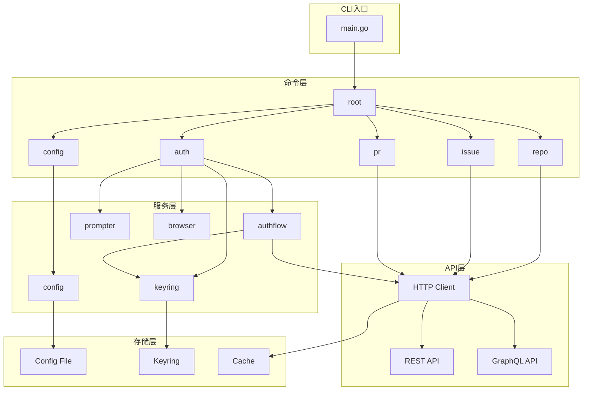

# 架构设计说明

本文档描述 gitcode-cli 的架构设计，包括分层架构、核心设计模式、模块关系和关键设计决策。

## 1. 整体架构

### 1.1 架构图

```
┌─────────────────────────────────────────────────────────────────────────┐
│                              用户界面层                                   │
│  ┌─────────────────────────────────────────────────────────────────┐   │
│  │                      CLI 入口 (cmd/gc/main.go)                   │   │
│  └─────────────────────────────────────────────────────────────────┘   │
└─────────────────────────────────────────────────────────────────────────┘
                                    │
                                    ▼
┌─────────────────────────────────────────────────────────────────────────┐
│                              命令层 (pkg/cmd/)                           │
│  ┌──────────┐ ┌──────────┐ ┌──────────┐ ┌──────────┐ ┌──────────┐     │
│  │   auth   │ │   repo   │ │  issue   │ │    pr    │ │  config  │     │
│  └──────────┘ └──────────┘ └──────────┘ └──────────┘ └──────────┘     │
│  ┌──────────┐ ┌──────────┐ ┌──────────┐ ┌──────────┐                   │
│  │   user   │ │   api    │ │extension │ │  root    │                   │
│  └──────────┘ └──────────┘ └──────────┘ └──────────┘                   │
└─────────────────────────────────────────────────────────────────────────┘
                                    │
                                    ▼
┌─────────────────────────────────────────────────────────────────────────┐
│                            服务层 (internal/)                            │
│  ┌──────────────┐ ┌──────────────┐ ┌──────────────┐ ┌──────────────┐   │
│  │    config    │ │   authflow   │ │   prompter   │ │   browser    │   │
│  └──────────────┘ └──────────────┘ └──────────────┘ └──────────────┘   │
│  ┌──────────────┐ ┌──────────────┐ ┌──────────────┐ ┌──────────────┐   │
│  │  tableprinter│ │    keyring   │ │    update    │ │    gcrepo    │   │
│  └──────────────┘ └──────────────┘ └──────────────┘ └──────────────┘   │
└─────────────────────────────────────────────────────────────────────────┘
                                    │
                                    ▼
┌─────────────────────────────────────────────────────────────────────────┐
│                           API 客户端层 (api/)                            │
│  ┌──────────────────────────────────────────────────────────────────┐   │
│  │                        HTTP Client                                │   │
│  │  ┌────────────┐  ┌────────────┐  ┌────────────┐  ┌────────────┐  │   │
│  │  │  REST API  │  │ GraphQL API│  │   Cache    │  │   Retry    │  │   │
│  │  └────────────┘  └────────────┘  └────────────┘  └────────────┘  │   │
│  └──────────────────────────────────────────────────────────────────┘   │
└─────────────────────────────────────────────────────────────────────────┘
                                    │
                                    ▼
┌─────────────────────────────────────────────────────────────────────────┐
│                            存储层 (config/)                              │
│  ┌──────────────┐ ┌──────────────┐ ┌──────────────┐ ┌──────────────┐   │
│  │  Config File │ │   Keyring    │ │    Cache     │ │    State     │   │
│  │   (YAML)     │ │  (加密存储)   │ │   (缓存)     │ │   (状态)     │   │
│  └──────────────┘ └──────────────┘ └──────────────┘ └──────────────┘   │
└─────────────────────────────────────────────────────────────────────────┘
```

### 1.2 分层原则

| 层级 | 职责 | 依赖方向 |
|------|------|----------|
| 用户界面层 | 处理命令行输入输出 | 依赖命令层 |
| 命令层 | 解析命令、处理业务逻辑 | 依赖服务层 |
| 服务层 | 提供通用服务功能 | 依赖API层、存储层 |
| API客户端层 | 封装外部API调用 | 依赖存储层 |
| 存储层 | 数据持久化 | 无依赖 |

### 1.3 设计原则

1. **单一职责原则 (SRP)**: 每个模块只负责一个功能
2. **依赖倒置原则 (DIP)**: 高层模块不依赖低层模块，都依赖抽象
3. **接口隔离原则 (ISP)**: 使用小接口而非大接口
4. **开闭原则 (OCP)**: 对扩展开放，对修改关闭

---

## 2. 核心设计模式

### 2.1 工厂模式 (Factory Pattern)

用于创建和管理复杂对象的依赖注入。

```go
// pkg/cmdutil/factory.go
type Factory struct {
    // 应用信息
    AppVersion     string
    ExecutableName string

    // 注入的服务
    Browser          browser.Browser
    ExtensionManager extensions.ExtensionManager
    GitClient        *git.Client
    IOStreams        *iostreams.IOStreams
    Prompter         prompter.Prompter

    // 延迟初始化的依赖（函数式）
    BaseRepo        func() (gcrepo.Interface, error)
    Branch          func() (string, error)
    Config          func() (gc.Config, error)
    HttpClient      func() (*http.Client, error)
    PlainHttpClient func() (*http.Client, error)
    Remotes         func() (context.Remotes, error)
}
```

**优势**:
- 解耦对象创建和使用
- 便于单元测试（可注入 Mock）
- 管理复杂的依赖关系

### 2.2 命令模式 (Command Pattern)

使用 Cobra 框架实现 CLI 命令。

```go
// pkg/cmd/auth/login/login.go
func NewCmdLogin(f *cmdutil.Factory, runF func(*LoginOptions) error) *cobra.Command {
    opts := &LoginOptions{
        IO:         f.IOStreams,
        Config:     f.Config,
        HttpClient: f.HttpClient,
        Prompter:   f.Prompter,
        Browser:    f.Browser,
    }

    cmd := &cobra.Command{
        Use:   "login",
        Short: "Log in to a GitCode account",
        RunE: func(cmd *cobra.Command, args []string) error {
            if runF != nil {
                return runF(opts)
            }
            return loginRun(opts)
        },
    }

    return cmd
}
```

### 2.3 中间件模式 (Middleware Pattern)

用于 HTTP 请求处理的链式处理。

```go
// api/http_client.go
type RoundTripperFunc func(*http.Request) (*http.Response, error)

// 中间件链
client.Transport = AddAuthTokenHeader(client.Transport, cfg)
client.Transport = AddCacheTTLHeader(client.Transport, ttl)
client.Transport = RetryMiddleware(client.Transport, 3)
```

### 2.4 策略模式 (Strategy Pattern)

用于不同的认证方式。

```go
// internal/authflow/strategy.go
type AuthStrategy interface {
    Authenticate() (token string, username string, error)
}

type TokenAuthStrategy struct {
    token string
}

type OAuthDeviceFlowStrategy struct {
    hostname string
    browser  browser.Browser
}
```

### 2.5 选项模式 (Option Pattern)

用于灵活配置。

```go
// internal/tableprinter/table_printer.go
type TableOption func(*TablePrinter)

func WithHeader(columns ...string) headerOption {
    return headerOption{columns}
}
```

---

## 3. 模块关系图



---

## 4. 关键设计决策

### 4.1 为什么选择 Go 语言？

| 因素 | 分析 |
|------|------|
| 跨平台编译 | Go 支持一次编译，多平台运行，简化发布流程 |
| 单二进制部署 | 无运行时依赖，用户只需下载一个可执行文件 |
| 标准库丰富 | 内置 HTTP、JSON、YAML、加密等库 |
| 性能优秀 | 编译型语言，启动快，内存占用低 |
| 社区支持 | 大量 CLI 工具使用 Go 开发（gh, kubectl, docker） |

### 4.2 为什么选择 Cobra？

| 特性 | 描述 |
|------|------|
| 子命令支持 | 完美支持 `gc auth login` 形式的命令结构 |
| 参数解析 | 自动生成帮助文档，支持必需/可选参数 |
| 自动补全 | 支持 Bash、Zsh、Fish、PowerShell |
| 广泛使用 | gh, kubectl, docker, hugo 等知名项目使用 |
| 文档生成 | 自动生成 man page 和 markdown 文档 |

### 4.3 为什么使用工厂模式？

1. **依赖注入**: 将依赖关系集中管理，便于测试时替换
2. **延迟初始化**: 只在需要时才初始化资源，提高启动速度
3. **解耦**: 命令层不直接依赖具体实现，依赖接口

### 4.4 为什么使用 YAML 配置？

1. **可读性**: YAML 比 JSON 更易读，支持注释
2. **兼容性**: 与 gh 保持一致，降低用户学习成本
3. **Go 支持**: `gopkg.in/yaml.v3` 提供完整支持

---

## 5. 扩展性设计

### 5.1 插件系统设计

```go
// pkg/extension/manager.go
type ExtensionManager interface {
    List() []Extension
    Install(name string) error
    Remove(name string) error
    Update(name string) error
}

type Extension interface {
    Name() string
    Version() string
    Execute(args []string) error
}
```

### 5.2 API 版本兼容

```go
// internal/gcinstance/host.go
type APIVersion string

const (
    APIVersionV4 APIVersion = "v4"
    APIVersionV5 APIVersion = "v5"  // 预留
)

func RESTEndpoint(hostname string, version APIVersion) string {
    return fmt.Sprintf("https://%s/api/%s", hostname, version)
}
```

### 5.3 新命令添加流程

1. 在 `pkg/cmd/` 下创建新目录
2. 实现命令逻辑
3. 在 `pkg/cmd/root/root.go` 中注册命令
4. 编写单元测试
5. 更新文档

---

## 6. GitCode API 差异说明

GitCode API 基于 GitLab API，与 GitHub API 有以下主要差异：

| 功能 | GitHub | GitCode/GitLab |
|------|--------|----------------|
| Issue 编号 | #123 | #123 (iid) |
| PR | pull request | pull request |
| API 版本 | v3/graphql | v4/v5 |
| 认证 | OAuth/Token | OAuth/Token |
| 端点格式 | /repos/owner/repo | /projects/owner%2Frepo |

---

**最后更新**: 2026-03-22